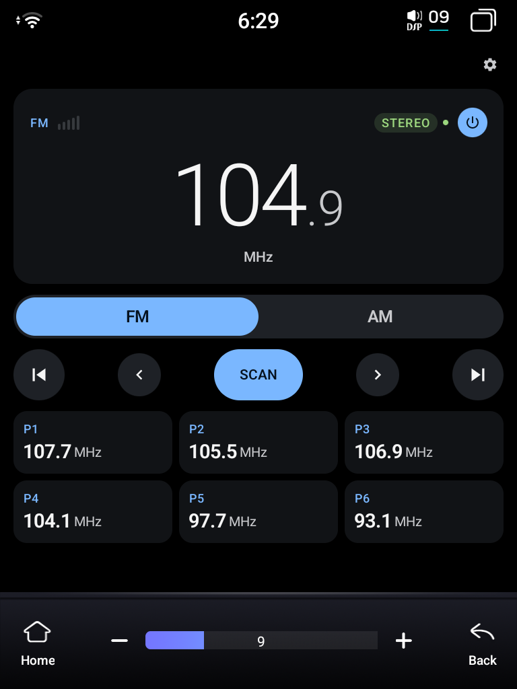
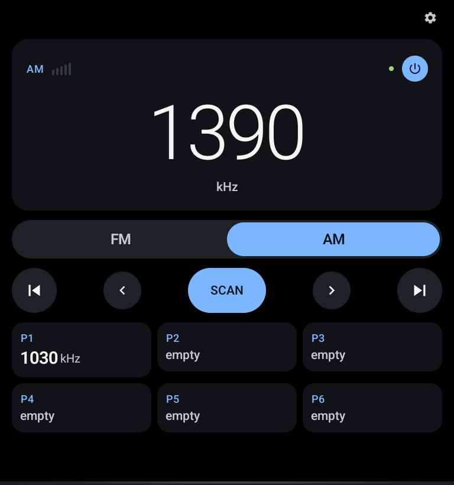
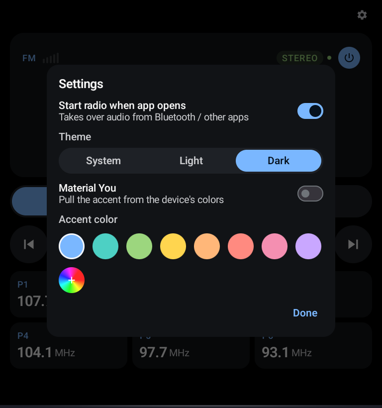

# FYT Radio

A clean, drop-in replacement UI for the FYT (Feiyiteng) head unit's stock AM/FM tuner
(`com.syu.carradio`). Side-loads as a normal user app; the stock radio stays installed
because the actual tuner chip lives on the MCU and the stock app is what we send commands
to over SYU's private IPC.

**Why this exists:** the stock radio UI has too much going on. This is a quiet, legible
front-end for the same tuner: big frequency readout, six presets, and not much else.

> **Built for the 768×1024 vertical "Tesla-style" FYT screen**, the UIS7870 ("7870")
> units, portrait 768 px wide × 1024 px tall. It should work just as well on the related
> **7862** boards (same SYU `com.syu.ms` IPC + `com.syu.carradio` stack); only the FM
> frequency-unit encoding differs by firmware and the app auto-detects that. Other
> resolutions aren't laid out for.
>
> Installs on **Android 8+ (minSdk 26)** so it runs on older units like the UIS7862
> (Android 10). It's a single universal APK. Install it directly; you don't need SAI
> or any split-APK installer.

Non-rooted. Coexists with the stock apps rather than replacing them.

## Screenshots

<p align="center">
  
  
  
</p>

<p align="center"><em>FM tuner · AM band · settings (theme, Material You / accent + custom color, auto-start). Shown full-screen on the 768×1024 unit.</em></p>

## What's built

- Large frequency display (FM rendered as `101.1 MHz`, AM as `1010 kHz`), **animated** on
  change. The MCU's frequency unit (kHz vs. dekahertz) is auto-detected, so the readout is
  correct across firmwares.
- AM/FM segmented band toggle.
- RDS: station name (PS), **scrolling radio text** (RT, the closest thing radio has to a
  "now playing" line), a **genre/PTY** chip, plus stereo + a "live" lock dot. (FM-only,
  signal permitting.) There's deliberately **no signal-strength meter**: the SYU radio
  module doesn't expose a reception level, so rather than fake a bar graph we show what's
  real (RDS lock + stereo).
- Opens on your **last station** (remembered across launches) and **highlights the preset**
  you're currently tuned to.
- **Power button** in the frequency-card corner. On = radio becomes the active MCU
  audio source (`C_APP_ID → APP_ID_RADIO`) and audio is unmuted. Off = the audio is
  **muted** (sound module `C_VOL → VOL_MUTE`) while we keep *holding* the radio source,
  so no other app (Bluetooth/Spotify) auto-resumes, a truly silent "off". Leaving the
  app while off auto-unmutes and releases the source, so the unit is never left stuck
  muted.
- Tune ± step (◁▷ = one channel step, **press-and-hold to keep stepping**), seek ±
  (⏮⏭ = auto-seek to the next station), and a center **SCAN** that sweeps the band and
  auto-stores presets ("auto discover").
- 6 presets per band, persisted in `SharedPreferences`. Tap to recall, long-press to
  save the current station. The RDS station name is saved alongside the frequency when
  it's known, so tiles can read "92.5 / KEXP".
- Settings behind a corner gear (no extra tab): **theme** (System / Light / Dark, defaults
  to System), **accent color** (preset swatches, an arbitrary **custom color** picker
  with hue + saturation/value, or **Material You** to pull the accent from the device's
  colors), plus the auto-start and **force-mono** (cleaner weak-FM audio) toggles.
- **Start radio when app opens** (on by default): on launch, and whenever you switch back
  to the app from Bluetooth/another source, the radio reclaims the MCU audio source,
  pausing whatever else was playing. Turn it off to leave the current source alone until
  you tap power.
- "No tuner feedback yet" diagnostic panel that lists the last 20 SYU module updates
  received, handy for confirming the MCU is awake and talking (see `NOTES.md`).

## Project layout

```
app/
  src/main/AndroidManifest.xml
  src/main/kotlin/com/fytradio/
    MainActivity.kt
    radio/
      RadioController.kt     ← StateFlows + IPC callback handling, all command logic
      SyuRadioBridge.kt      ← raw IBinder transact to com.syu.ms (toolkit + modules)
      PresetStore.kt         ← SharedPreferences-backed presets (freq + RDS name)
      RadioModels.kt         ← Band, Region, TunerState, formatters
    ui/
      RadioScreen.kt
      FrequencyDisplay.kt
      BandSelector.kt
      TuneControls.kt
      PresetGrid.kt
      SettingsDialog.kt      ← theme / accent / auto-start
      theme/Theme.kt
  src/main/res/values/{strings.xml,themes.xml}
.github/workflows/{build.yml,release.yml}
build.gradle.kts                 ← root
settings.gradle.kts
gradle/libs.versions.toml
```

`RadioController` is the only class that talks to the SYU bridge. UI is dumb Compose:
every screen consumes `StateFlow` and emits callbacks.

## Releases & updates

Pushing a `vX.Y.Z` tag triggers `.github/workflows/release.yml`, which builds a **signed**
release APK and attaches it to a GitHub Release. Grab the latest from the
[Releases page](https://github.com/PimpinPumpkin/FytRadio/releases), copy it to the unit,
and install.

Every release is signed with the **same key** (held in the repo's Actions secrets), so
new versions **install in place** over an older release. No uninstall, no signature
conflict. `versionCode`/`versionName` are derived from the tag automatically.

> One-time note: if you're currently running a locally-built **debug** APK, uninstall it
> once before installing the first signed release (debug and release use different keys).
> After that, every release upgrades in place.

Cutting a release:

```bash
git tag v0.1.0 && git push origin v0.1.0    # CI builds + publishes the signed APK
```

## Build & deploy to the unit (development)

Wireless debugging only; the head unit has no usable USB-data port. The adb
port rolls on every reboot.

```bash
# 1. connect (port changes each reboot)
adb connect 192.168.158.192:<current_port>
adb devices                                    # confirm exactly one device

# 2. build a debug APK
cd ~/FytRadio
./gradlew :app:assembleDebug

# 3. install + launch
adb install -r app/build/outputs/apk/debug/app-debug.apk
adb shell monkey -p com.fytradio 1
```

No signing setup needed for debug builds. Same pattern as FytBt.

## Bench power (READ THIS if the tuner shows no live data)

These units watch the **ACC/ignition** line *separately* from constant **B+** to
decide they're truly powered on. With only one 12 V rail connected, the Android SoC
stays alive (post-ignition keep-alive) but the **MCU parks in standby**. Its `Qin`
log shows `mcuState 23` / `sTopAppWhenMcuOff`, and the tuner chip stays unpowered.
Commands are still accepted, but you get **no frequency / RDS / signal back**.

On a bench, wire **both** to +12 V:

- **B+** (constant battery, commonly yellow)
- **ACC** (ignition/accessory, commonly red): tie it to the same +12 V as B+
- **GND** (black)

Plus the **antenna** for actual reception. Once ACC is seen high with B+ present, the
MCU comes to full power and starts emitting `U_FREQ` / RDS, and the live dot goes green.

## What to verify on first install

1. Launch → big frequency card renders FM (P1 or the default).
2. Tap the **power button** (corner of the freq card) → `Qin: UI Change AppId to 1`
   (radio is now the active source). Tap again → `AppId to 0` (radio released).
3. Toggle **AM/FM** → the MCU echoes `U_EXTRA_FREQ_INFO` with that band's
   `[min,max,step,count]` (verified).
4. Tap tune ◁▷ / seek ⏮⏭ / **SCAN** → commands dispatch over IPC; with the MCU awake
   (see Bench power) the frequency/RDS update and the live dot turns green.
5. Long-press a preset slot → saves the current frequency. Tap to recall.

## Known limitations

- **No direct chip control.** Non-rooted, so we don't drive the tuner chip ourselves;
  we drive the same SYU radio module the stock app uses, which drives the chip via the
  MCU. (Protocol fully reverse-engineered and verified; see `NOTES.md`.)
- **Audio is invisible to Android.** The radio output runs through the MCU's analog
  path, so we can't apply software DSP, ducking, or per-station volume.
- **Live tuner data needs the MCU awake.** See Bench power above.
